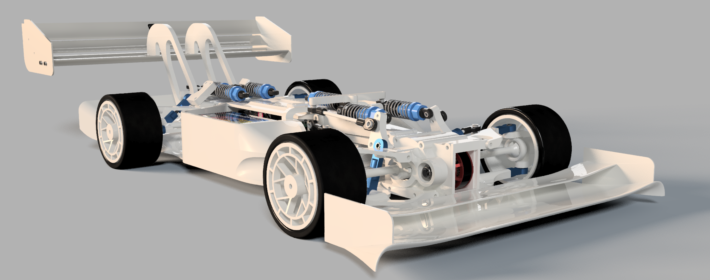

# High-Performance RC Car Project

# Disclamer: This repo is mostly for us to have a log of what we have done, as such there will not be any help with reproducing the project.

https://github.com/user-attachments/assets/5ad49097-7375-48fd-929b-7929f47fb8ee

https://github.com/user-attachments/assets/9d515676-ec9a-4bec-ab3a-135b9c511faa

https://github.com/user-attachments/assets/2ce086a1-ba34-4368-8fec-eeab37d5dc80

  
  

  
  

## Authors and Acknowledgments

### Project Team
- **Aron Cullberg**
  - Leading software development and hardware integration

- **Viktor Hajto**
  - Leading mechanical design and CAD development

